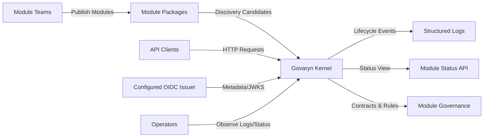

# 3. System Scope and Context

## 3.1 Business Context

The Govaryn kernel provides a managed runtime for modular capabilities. Module teams
publish compliant modules that can be discovered, validated, registered, and started
without compromising platform integrity. Operators rely on structured startup logs and
status views to understand module health and enforce governance.

## 3.2 Technical Context

The module system operates inside the kernel runtime:

- Modules are Spring-managed `KernelModule` components or classpath-discovered candidates.
- Module metadata conforms to the versioned module contract.
- The kernel acts as gatekeeper and orchestrator for module lifecycle phases.
- Module capabilities declare required/provided features for dependency resolution.
- Module API usage is constrained by kernel API classification (`declared`, `provisional`, `internal`).
- Kernel HTTP security is centralized in kernel-owned Spring Security configuration.
- JWT validation is based on one configured OIDC issuer and explicit audience validation.
- Public paths are configured in kernel security properties; all other paths require authentication when security is enabled.
- Modules consume kernel-provided authentication context and authorities.

## Context Diagram

