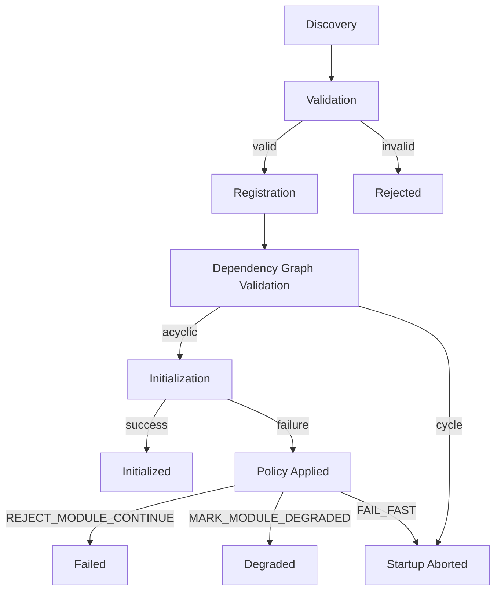
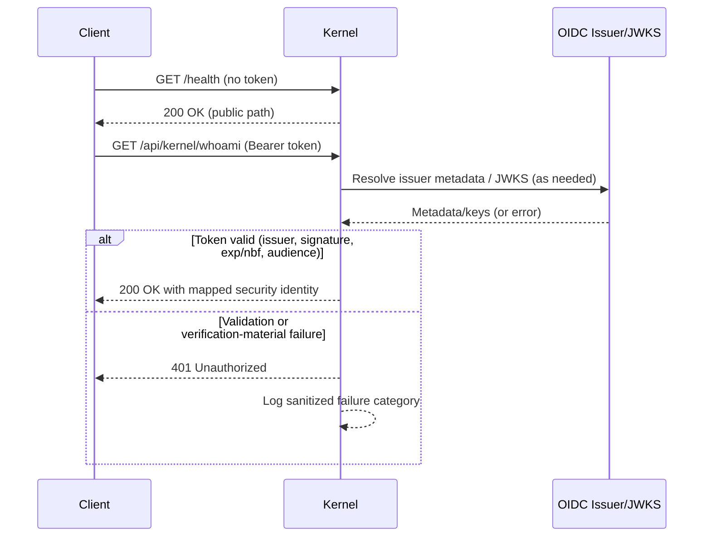

# 6. Runtime View

This section captures runtime behavior of the modular kernel.

## Runtime Scenarios

1. Module startup lifecycle (discovery to initialization)
2. Initialization failure handling with policy enforcement
3. Runtime start failure handling
4. Observability and operations flow
5. HTTP authentication flow for public/protected endpoints

## Module Startup Lifecycle

## Failure Handling (Initialization and Start)

- Initialization errors are captured with module context and failure policy.
- `REJECT_MODULE_CONTINUE` keeps the kernel running and marks the module as `failed`.
- `MARK_MODULE_DEGRADED` keeps the kernel running and marks the module as `degraded`.
- `FAIL_FAST` aborts kernel startup when a module fails.

## Observability Flow

- Each phase emits structured logs (`module_discovered`, `module_validation_report`,
  `module_registered`, `module_initialization_*`, `module_start_failed`).
- A startup summary is emitted once per kernel start:
  `found`, `validated`, `rejected`, `registered`, `failed`, `degraded`.
- Module status is exposed through the status service.

## HTTP Authentication Flow (Current Foundation)

