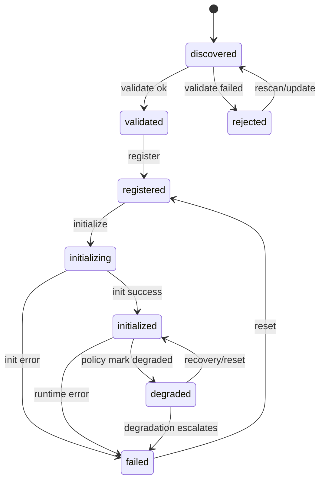

# Module Lifecycle Model v1.0.0

## 1. Purpose
This document defines the module lifecycle used by the kernel to process modules from discovery to runtime operation and failure states.

It is the baseline for:
- module registry behavior,
- state-dependent action authorization,
- consistent failure handling.

## 2. States

| State | Description |
| --- | --- |
| `discovered` | Module artifact/manifest was found but not validated yet. |
| `validated` | Contract and compatibility checks passed. |
| `rejected` | Validation failed; module is not allowed to proceed. |
| `registered` | Module is stored in registry and eligible for initialization. |
| `initializing` | Kernel is executing module initialization lifecycle hook(s). |
| `initialized` | Module is successfully initialized and operational. |
| `failed` | Runtime or initialization failure occurred after registration. |
| `degraded` | Module remains active with restricted behavior after policy-approved degradation. |

## 3. State Diagram

## 4. Transition Rules

| From | To | Trigger | Allowed |
| --- | --- | --- | --- |
| `discovered` | `validated` | Validation succeeds | Yes |
| `discovered` | `rejected` | Validation fails | Yes |
| `validated` | `registered` | Kernel registers module | Yes |
| `registered` | `initializing` | Kernel starts initialization | Yes |
| `initializing` | `initialized` | Initialization succeeds | Yes |
| `initializing` | `failed` | Initialization throws/returns failure | Yes |
| `initialized` | `failed` | Runtime fatal error or health failure policy triggers failure | Yes |
| `initialized` | `degraded` | Failure policy resolves runtime failure to degraded mode | Yes |
| `degraded` | `failed` | Further failure or policy escalation | Yes |
| `degraded` | `initialized` | Recovery/reset succeeds | Yes |
| `failed` | `registered` | Kernel reset/recovery action | Yes |
| `rejected` | `discovered` | Artifact updated or rescan requested | Yes |

All other transitions are invalid and MUST be rejected by the kernel.

## 5. Allowed Actions by State

| State | Allowed Kernel Actions | Forbidden Examples |
| --- | --- | --- |
| `discovered` | validate, inspect metadata, reject | initialize, activate runtime hooks |
| `validated` | register, inspect metadata | initialize before registration |
| `rejected` | inspect rejection reason, rescan, purge | register, initialize |
| `registered` | initialize, unregister, inspect | runtime invoke before init |
| `initializing` | monitor timeout, abort, fail transition | duplicate initialize calls |
| `initialized` | runtime invocation, health checks, stop/unregister | second initialize without reset |
| `degraded` | limited runtime invocation, degraded health reporting, recovery/reset, stop/unregister | full-service invocation that violates degraded mode gates |
| `failed` | inspect failure reason, reset to `registered`, unregister | runtime invocation |

## 6. Registry Baseline
Registry entries MUST include at least:
- `moduleId`
- `moduleVersion`
- current `state`
- `stateUpdatedAt`
- `lastError` (nullable)

Registry writes MUST be atomic per state transition.

## 7. Error Handling Baseline
- Validation errors move module to `rejected` with structured reason codes.
- Initialization errors move module to `failed`.
- Runtime errors move module to `failed` by default; failure policy may transition module to `degraded` instead.
- Modules in `failed` are non-routable for runtime invocation until reset.
- Modules in `degraded` are routable only through degraded-mode gates defined by kernel policy.
- Kernel MUST emit lifecycle events for every successful transition and every rejected transition request.
- Policy-based alternatives (for example degraded operation) are defined in:
  [`../../module-failure-policy/v1.0.0/failure-policy.md`](../../module-failure-policy/v1.0.0/failure-policy.md)

## 8. Conformance
A kernel implementation is conformant with lifecycle model `v1.0.0` if it:
1. supports all states listed in section 2,
2. enforces transition rules in section 4,
3. enforces action gating in section 5,
4. records registry/error semantics in sections 6 and 7.
